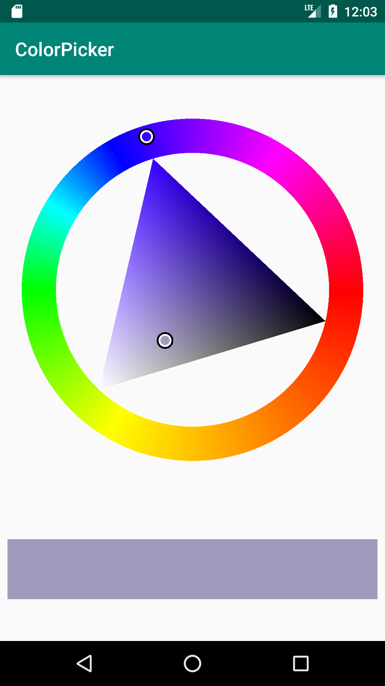
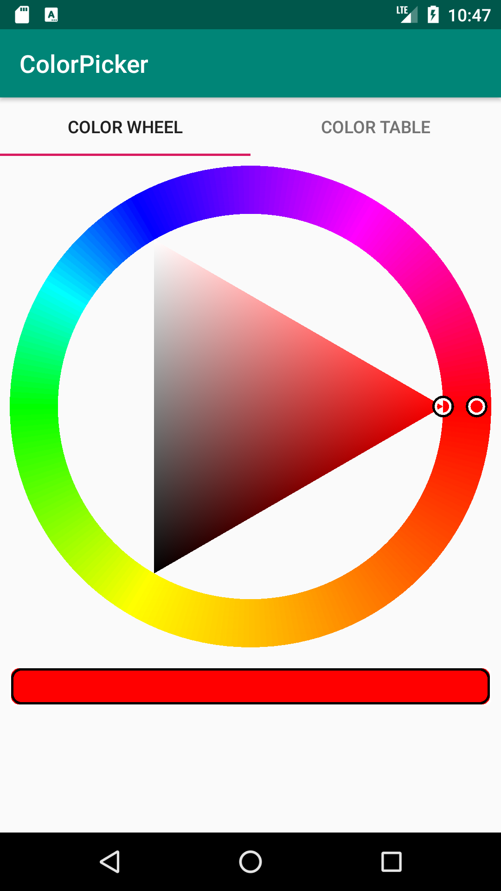
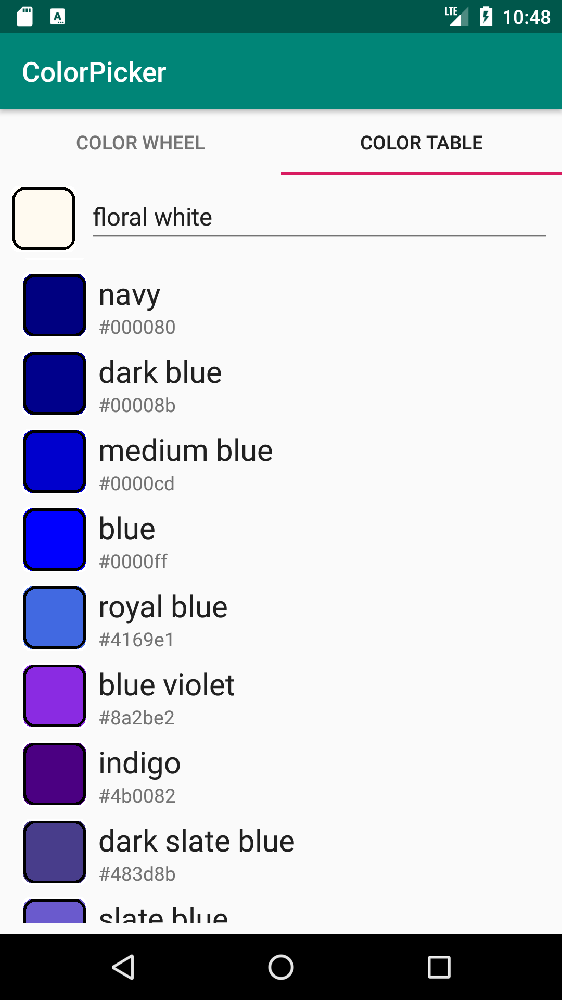

# Color Picker for Android

This project written in Kotlin contains a color picker view using a triangle wheel, a color 
table and a tabbed combination of both. The color wheel uses
the Red-Yellow-Blue model which seems more natural from an artistic point of view.

## Fact Sheet

* minSDK: 24
* Language: Kotlin
* Access via gradle and jitpack

### Access via gradle (copy/paste from jitpack)

Add it in your root `build.gradle` at the end of repositories:

~~~
	allprojects {
		repositories {
			...
			maven { url 'https://jitpack.io' }
		}
	}
~~~

Step 2. Add the dependency

~~~
	dependencies {
	        implementation 'com.github.searles:colorpicker:Tag'
	}
~~~

Replace `Tag` with current version (current 0.4)

### Important classes

* Important classes: 
    + `ColorWheelView`: View showing a color triangle. 
        - Set and access color using `{get|set}Color(int argb)`.
        - `setOnColorChangedListener` sets the listener.
    + `ColorTableFragment`: Fragment showing a list of colors.
    + `ColorViewFragment`: Combination of wheel and table using a tab layout.

## Out of focus

* Support for alpha channel.

## Screenshot

